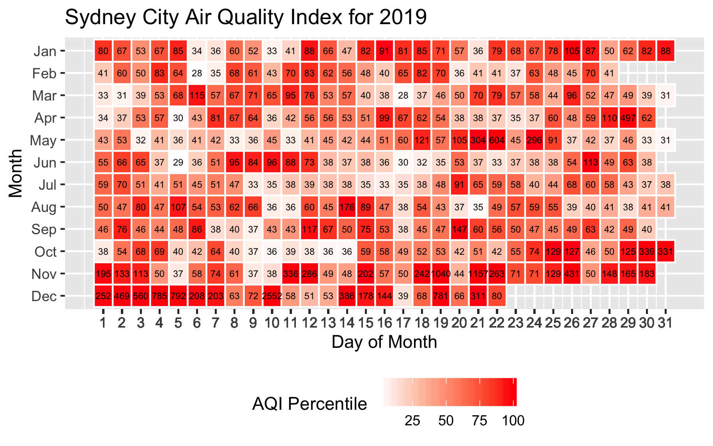
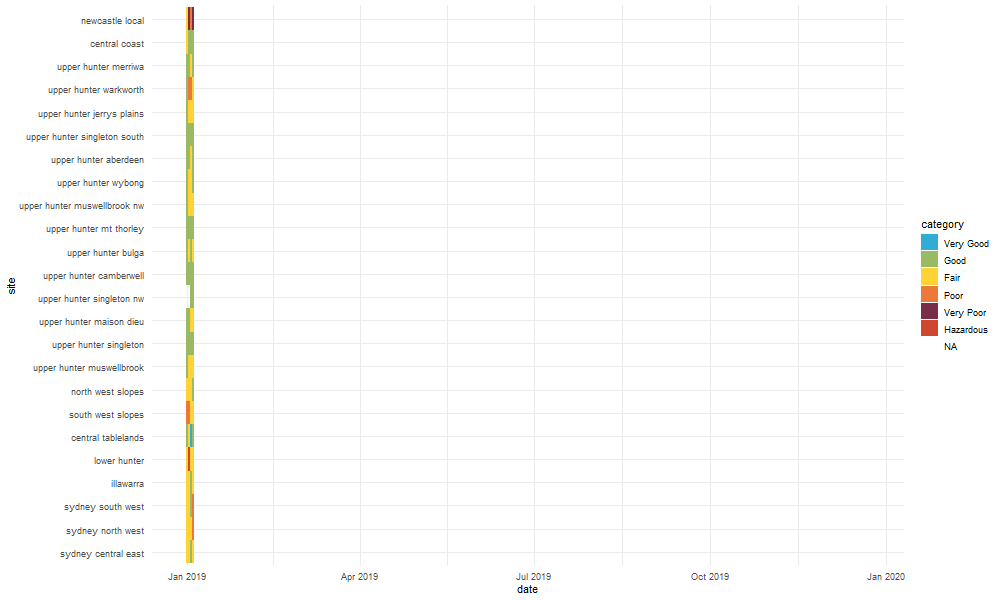
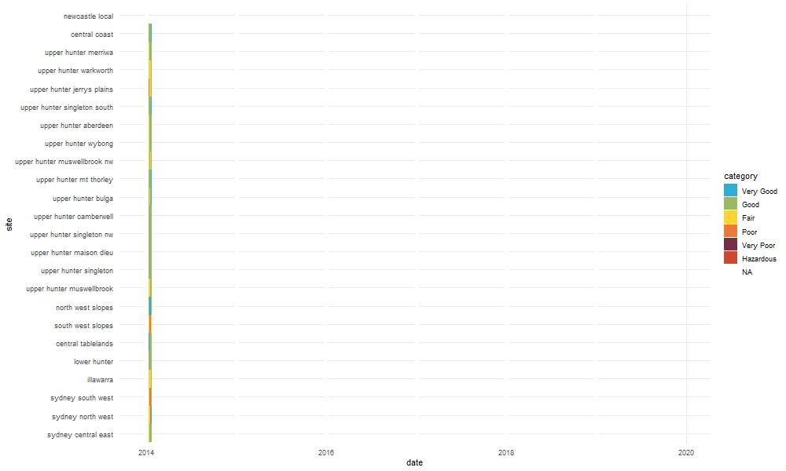

<!-- README.md is generated from README.Rmd. Please edit that file -->

# Is it smoky right now?

<!-- badges: start -->

<!-- badges: end -->

This repo was created at rOpenSci \#ozunconf19 at University of Sydney
Dec 11-13 2019. The contributors to this project were Jen Richmond, John
Ormerod, Disha Patil, Lara Easdale, Emily Kothe, Dani Navarro, Dale
Machette, Kat Terris, and Lizzie
Reid.

The goal of smoky group was to pull together air quality data into a
site akin to [isithotrightnow](https://isithotrightnow.com/).

We wanted to pull air quality data from authorities across Australia and
present it in a way that would allow the public to see how recent air
quality events relate to historical data. We also wanted to include
information to guide decision making.

# Things we worked on…

## deciding where to get data from

It took us a while to decide which data to use. We ended up settling on
NSW gov data, although this data is not ideal. The site will only let us
download daily average AQI. We are waiting on a call back re accessing
the API for [this
site](https://aqicn.org/city/australia/nsw/randwick/sydney-east/), which
may have more comprehensive and up to date data.

## making a shiny app

The shiny app starts with a pulldown for site choice and tells you
whether air quality is very good, good, fair, poor, very poor, or
hazardous, along with a recommendation how this might impact activities.

The app also displays the grid plot, the gganimate gif, and links to a
page where you can support the RFS.

Stay tuned for a link once we work out how to host it on a server….

## grid plot

We have been working on replicating plot 3 on the
[isithotrightnow](https://isithotrightnow.com/) site.

There is the version that Lizzie created for 2019. The colour coding is
<<<<<<< HEAD
percentiles relative to monthly values.
=======
percentiles relative to monthly values. Note that the AQI value for
Tuesday 10 Dec is too big for the
box\!
>>>>>>> c468be86fb47d579c2c44eed81e298adcd936488

The code to create Lizzie’s grid plots is [here](/R/grid_plot.R)

## gganimated historical change plot

We used this tweet as a model…

<blockquote class="twitter-tweet">

Here's my early submission to
<a href="https://twitter.com/hashtag/TidyTuesday?src=hash&amp;ref_src=twsrc%5Etfw">\#TidyTuesday</a>.
This plot design (not my own) is striking for measles
<a href="https://twitter.com/hashtag/vaccines?src=hash&amp;ref_src=twsrc%5Etfw">\#vaccines</a><a href="https://twitter.com/hashtag/rstats?src=hash&amp;ref_src=twsrc%5Etfw">\#rstats</a>
<a href="https://twitter.com/hashtag/r4ds?src=hash&amp;ref_src=twsrc%5Etfw">\#r4ds</a>  Code:
<a href="https://t.co/1iJls62hnk">https://t.co/1iJls62hnk</a>
<a href="https://t.co/bPdjv8lD5h">pic.twitter.com/bPdjv8lD5h</a>

— James Wade (@JamesHWade)
<a href="https://twitter.com/JamesHWade/status/1204223471519256577?ref_src=twsrc%5Etfw">December
10, 2019</a>

</blockquote>

… and made this animated plot of AQI levels across 2019, colour coded by
hazard level. You can find the code that generates these animations in
the [smoky\_john Rmd file](smoky_john2.Rmd).

This plot captures 2019 data. 

This plot captures 2014-2019 data. 
